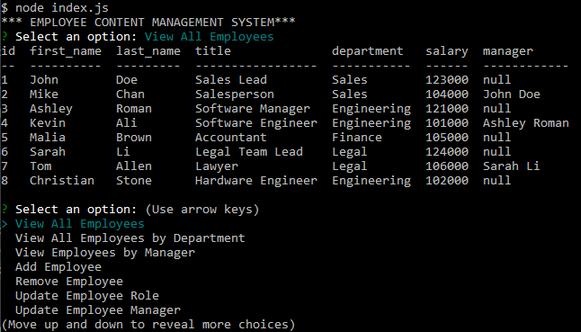
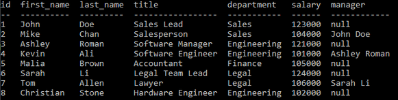
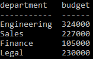

# Employee_Content_Management_System
This project is a node application for managing information about a company's employees, job roles, and departments. The project is written in javascript. The inquirer and mysql modules are also used.

## The Database
A user can use the application to Create, Read, Update, and Delete information about employees, job roles, and departments. The application talks with a local mysql database containing three tables with the properties shown in diagram.

By performing `LEFT JOIN`s on the tables, the data can be combined to provide meaningful answers to various queries. 

## Usage
The application requires a local mysql server. 

schema.sql and seed.sql in the docs/ folder can be used to create and seed the database.

Run `npm install` to install the required packages. 

Create and set the environment variable `SQL_PSWD` to your database password.

Type `node index.js` to run the application.

You'll be prompted to select from a list of options.

A full list of the options are shown below. For a couple of the options the expected output is shown (based on the seed.sql data).
* View All Employees

  

* View All Employees by Department
* View Employees by Manager
* Add Employee
* Remove Employee
* Update Employee Role
* Update Employee Manager
* View All Roles
* Add Role
* Remove Role
* View All Departments
* Add Department
* Remove Department
* View Total Budget by Department

  

* Exit

### Video Walkthrough

A video of the application in action can be viewed [here](https://drive.google.com/file/d/1uU53q28VY0Gl204tbq3T0coLt4SyRIa_/view?usp=sharing).
The video walks through the following sequences:
* In MySQL Workbench:
  * Create the database in MySQL Workbench using docs/schema.sql -> Populate the database using docs/seed.sql -> SELECT * FROM employee -> SELECT * FROM role -> SELECT * FROM departments
* In the Employee Content Management System application:
  * View All Employees
  * View All Employees by Department
  * View Employees by Manager
  * Add Employee -> View All Employees
  * Update Employee Role -> View All Employees
  * Update Employee Manager -> View All Employees -> View Employees by Manager
  * Remove Employee -> View All Employees
  * View All Roles
  * Add Role -> View All Roles
  * Remove Role -> View All Roles
  * View All Departments
  * Add Department -> View All Departments
  * Remove Department -> View All Departments
  * View Total Budget by Department
  * Exit 

  (Set the video resolution to 720p for optimal viewing.)